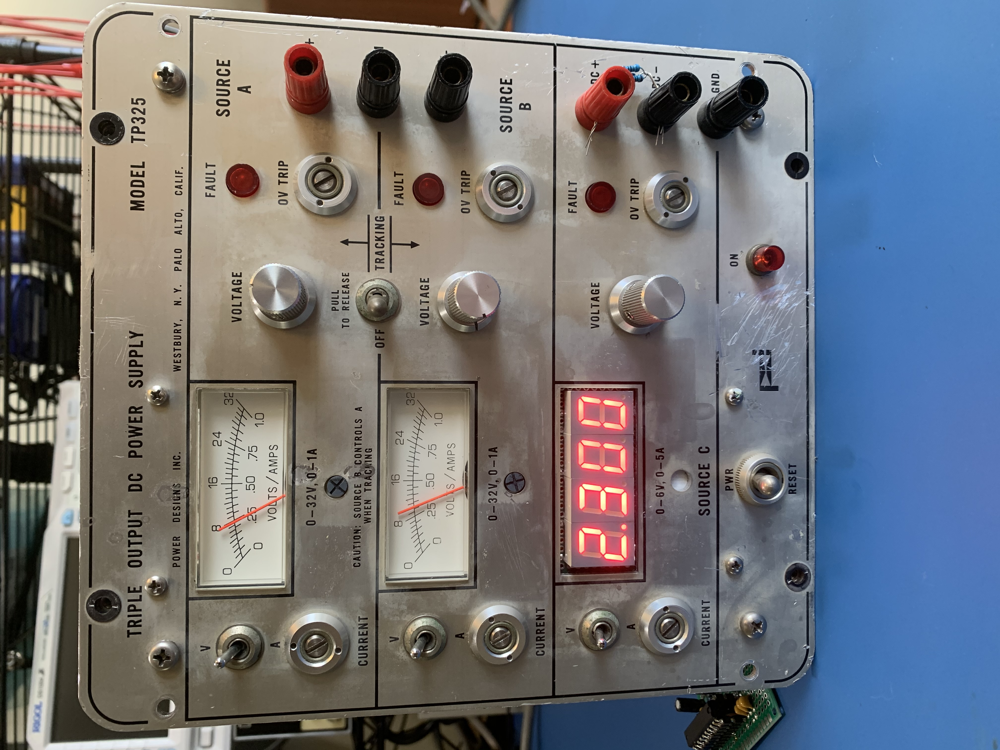
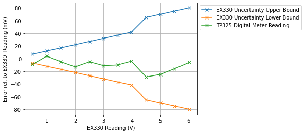

# tp325-meter
Refurbish a  Power Designs TP325 triple output power supply with a digital meter.

## Demo & Pictures

[Demonstration Video.](https://drive.google.com/file/d/1OvPalh1_EWo_ID4mvg1HP6uFQ4V9FpZM/view?usp=sharing)

## Accuracy

